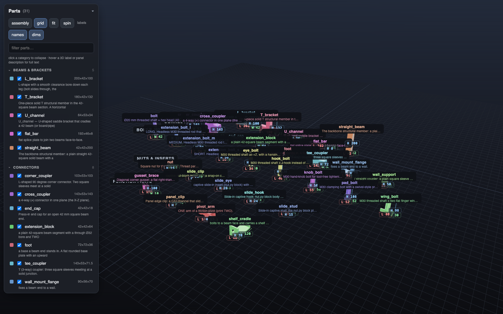

# 3d-print-modeling

A [Claude Code](https://claude.com/claude-code) / Claude **Agent Skill** for designing FDM 3D-print parts as parametric Python (`trimesh` + `manifold3d` + `shapely` or `build123d`), then viewing and screenshotting them headlessly so Claude checks the geometry by eye on every change.

No GUI CAD. The geometry engine is pip-installable, the viewer runs in a browser, and verification is a headless render loop instead of "looks watertight, ship it."



*The bundled parts viewer: a self-contained HTML file that grids every STL in a project, groups them by category, and floats a name + description label and L/W/H dimension lines on each part.*

## What it does

- **Parametric-first.** One `build.py` with a `PARAMETERS` block is the source of truth. Edit values, rerun, never hand-edit mesh output.
- **View-screenshot-iterate.** Bundled `serve.py` + `shoot.py` render iso / front / side / top + two section cuts to PNG via headless Chromium, so Claude looks at the part from multiple angles before claiming done. Numeric and watertight checks miss orientation, collision, floating-part, and feature-distortion bugs.
- **Kit fan-out.** When you want many independent parts at once, the skill fans out one subagent per part against a shared `lib.py` helper API, then builds them in one pass.
- **Two viewers.** `viewer_glb.html` for a single live-reloading assembly GLB (per-part toggles, explode, section cut, dimension lines, Z-up). `parts_viewer.py` bundles a directory of STLs into one double-click-to-open HTML grid.
- **FDM design rules + mechanisms references** loaded on demand (print orientation, self-supporting geometry, min feature size, gears/worms, press-fits and clearances).

Pairs with [bambu-3mf-export](https://github.com/m-esm/bambu-3mf-export) to turn finished STLs into a sliceable Bambu Studio `.3mf` project.

## Install

### Option 1: Manual (works everywhere, all projects)

```bash
git clone https://github.com/m-esm/3d-print-modeling ~/.claude/skills/3d-print-modeling
```

Restart Claude Code. The skill auto-loads when you describe a modeling task, or run `/3d-print-modeling`.

### Option 2: Plugin marketplace (supports updates)

```
/plugin marketplace add m-esm/3d-print-modeling
/plugin install 3d-print-modeling@3d-print-modeling
```

Update later with `/plugin marketplace update 3d-print-modeling`.

## Usage

Just describe the part. Claude loads the skill and follows the loop:

> Make a parametric M8 bolt and a matching nut, then a wall bracket they bolt through.

> This part is too flexible. Thicken the spine to 4mm and add a 45-degree gusset.

Or invoke it explicitly with `/3d-print-modeling`.

## Requirements

- Python 3.9+ for the trimesh path (Python 3.10+ if you use the `build123d` BREP path).
- The bundled `scripts/requirements.txt` pins the toolchain. Install with:
  ```bash
  pip3 install --user -r scripts/requirements.txt
  python3 -m playwright install chromium
  ```

## What's in here

```
SKILL.md                 the skill itself (workflow + FDM rules Claude reads)
references/
  fdm-design-rules.md    print orientation, supports, min feature size, PLA vs PETG
  mechanisms-and-fits.md gears/worms, keyed bores, press-fits, bearings, clutches
scripts/                 generic, copy into a project as needed
  serve.py               localhost static server for the viewer
  shoot.py               headless multi-angle Playwright renders
  viewer_glb.html        Three.js assembly viewer (toggles, explode, section, dims)
  viewer_stl.html        single-STL viewer for mesh surgery
  parts_viewer.py        bundle a dir of STLs into one self-contained HTML grid
  stlpaths.py            subsystem output router (keeps the repo root clean)
  Makefile               make build / export / viewer / shot / install / all
  requirements.txt       pinned toolchain
```

## Security

Skills can run code. This one ships Python scripts that Claude executes (mesh generation, a localhost static server, headless Chromium screenshots) and nothing else: no network calls beyond `pip`/`playwright install`, no credential access. Read `SKILL.md` and `scripts/` before installing, same as any skill.

## License

MIT. See [LICENSE](LICENSE).
